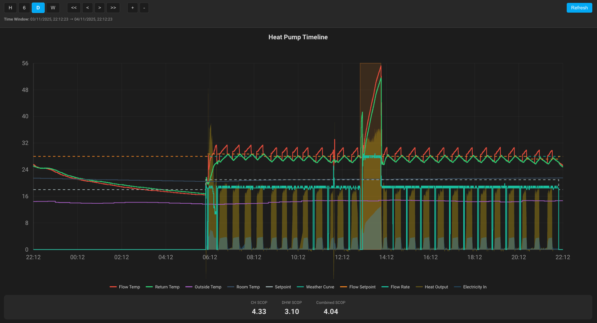
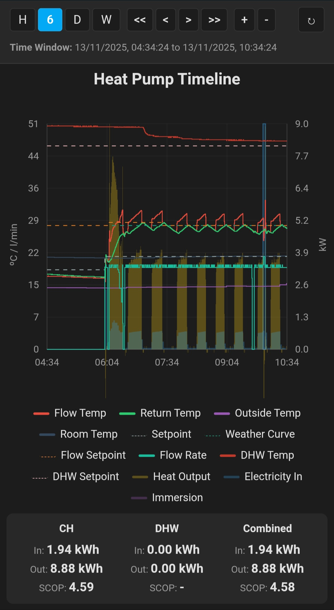
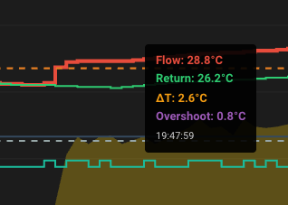
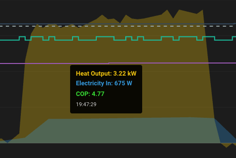

# Heat Pump Timeline Card

A custom Lovelace card for Home Assistant that displays heat pump performance metrics in an interactive timeline chart with advanced features like zoom, mode tracking, and SCOP calculations.  Developed entirely using Claude Code and Gemini CLI.  Started orignially by giving Claude Code a screen shot of Emoncms char and asking it if it understood it and if it could make a Home Assistant card.  It has subsequently been improved incrementally with Claude Code and Gemini.  This is intended as a convenient HA visualisation for data from tools like [Emoncms](https://emoncms.org/) and [OpenEnergyMonitor](https://openenergymonitor.org/).



## Features

- **Interactive Timeline Chart** with temperature and power data
- **Auto Full-Height Display** - Automatically fills the viewport when used in Panel (1 card) view
- **Click-and-Drag Zoom** to focus on specific time periods
- **DHW Mode Visualization** with translucent orange rectangles showing domestic hot water heating periods
- **SCOP Calculations** separated by mode (CH, DHW, and Combined)
- **Smart Tooltips** showing related metrics:
  - Flow/Return temps with Delta-T and Overshoot
  - Power values with COP calculation
  - Weather Curve and Flow Setpoint with Modulation
  - Room Temp and Setpoint with Overshoot
- **Step Interpolation** for accurate representation of periodic data
- **Configurable Time Offsets** to compensate for sensor recording delays
- **Hover Effects** with line embiggen for better visibility
- **Flexible Time Ranges** (1 hour, 6 hours, 1 day, 1 week, or custom zoom/pan)
- **Timeline Navigation** with pan (<<, <, >, >>) and zoom (+, -) buttons
- **Dynamic X-Axis Labels** that adapt to the current zoom level
- **Responsive Layout** that adapts to window resizing in real-time

## Installation

### Quick Start

1. **Download**: Get `heat-pump-timeline-card.js` from the [`dist` folder](https://github.com/matban666/heat-pump-timeline-card/tree/main/dist)
2. **Copy**: Place it in your `/config/www/` directory
3. **Register**: Add as a Lovelace resource at `/local/heat-pump-timeline-card.js` (type: JavaScript Module)
4. **Refresh**: Clear your browser cache (Ctrl+Shift+R)
5. **Add**: Add the card to your dashboard

💡 **Tip:** This card works best in its own **dedicated dashboard** with a Panel (1 card) view. In Panel mode, the card automatically fills the entire viewport height for maximum visibility. It works in standard Masonry layouts but can feel cramped.

📖 **[Detailed Installation Guide](INSTALLATION.md)** - Step-by-step instructions for creating a dedicated dashboard

### Direct Download Link

```bash
wget https://raw.githubusercontent.com/matban666/heat-pump-timeline-card/main/dist/heat-pump-timeline-card.js -O /config/www/heat-pump-timeline-card.js
```

### HACS Installation (Coming Soon)

HACS installation will be available once the card is submitted to the HACS default repository.

## Configuration

### Minimal Configuration

```yaml
type: custom:heat-pump-timeline-card
title: Heat Pump Performance
power_in_entity: sensor.heat_pump_power_input
power_out_entity: sensor.heat_pump_power_output
```

### Full Configuration

```yaml
type: custom:heat-pump-timeline-card
title: Heat Pump Performance
hours: 24  # Time range in hours (default: 1)
min_height: 200 # Chart minimum height in pixels (default: 200)
line_width: 1.0 # Width of the metric lines (default: 1.0)

# Required entities
power_in_entity: sensor.heat_pump_power_input
power_out_entity: sensor.heat_pump_power_output

# Optional temperature entities
flow_temp_entity: sensor.heat_pump_flow_temp
return_temp_entity: sensor.heat_pump_return_temp
outside_temp_entity: sensor.outside_temperature
inside_temp_entity: sensor.room_temperature
setpoint_entity: sensor.heating_setpoint

# Optional setpoint entities
weather_curve_setpoint_entity: sensor.weather_curve_setpoint
flow_setpoint_entity: sensor.flow_temp_setpoint

# Optional flow rate entity
flow_rate_entity: sensor.heat_pump_flow_rate

# Optional mode tracking (for DHW visualization)
mode_entity: sensor.heat_pump_mode

# Optional mode tracking (for defrost visualization)
defrost_entity: sensor.heat_pump_defrost_mode

# Optional immersion heater entity
immersion_entity: sensor.immersion_heater_power

# Optional DHW entities
dhw_temp_entity: sensor.dhw_tank_temperature
dhw_setpoint_entity: sensor.dhw_setpoint

# Optional time offsets (in seconds) - see Time Offset Configuration section
power_in_offset: 0
power_out_offset: 0
flow_temp_offset: 0
return_temp_offset: 0
outside_temp_offset: 0
inside_temp_offset: 0
setpoint_offset: 0
weather_curve_setpoint_offset: 0
flow_setpoint_offset: 0
flow_rate_offset: 0
mode_offset: 0
immersion_offset: 0
dhw_temp_offset: 0
dhw_setpoint_offset: 0
defrost_offset: 0
```

## Time Offset Configuration

### Overview

Time offset options allow you to shift any metric's timestamps to compensate for recording delays or synchronization issues between different sensors. This is particularly useful when sensors have different polling rates or processing delays.

### When to Use Time Offsets

Common scenarios where time offsets are helpful:

1. **Power Sensor Lag**: Power input sensors may lag behind power output sensors due to metering delays
2. **Temperature Sensor Delays**: Different temperature sensors may have different response times
3. **Remote Sensor Communication**: Network delays in wireless sensors can cause timing discrepancies
4. **Data Processing Lag**: Calculated values (like COP) may be recorded after the raw measurements

### Configuration Format

All offset values are in **seconds** and can be:
- **Positive** (e.g., `30`): Shifts data forward in time by that many seconds
- **Negative** (e.g., `-15`): Shifts data backward in time by that many seconds
- **Zero** or **omitted** (default): No time shift applied

### Available Offset Options

```yaml
type: custom:heat-pump-timeline-card
# ... entity configuration ...

# Power metrics
power_in_offset: 30        # Shift power input 30 seconds forward
power_out_offset: 0        # No shift for power output

# Temperature metrics
flow_temp_offset: 0        # Flow temperature
return_temp_offset: 0      # Return temperature
outside_temp_offset: 0     # Outside/ambient temperature
inside_temp_offset: 0      # Room temperature

# Setpoint metrics
setpoint_offset: 0         # Heating setpoint
weather_curve_setpoint_offset: 0  # Weather curve setpoint
flow_setpoint_offset: 0    # Flow temperature setpoint

# Other metrics
flow_rate_offset: 0        # Water flow rate
mode_offset: 0             # Operating mode
immersion_offset: 0        # Immersion heater power
dhw_temp_offset: 0         # DHW tank temperature
dhw_setpoint_offset: 0     # DHW setpoint
defrost_offset: 0          # Defrost mode
```

### Example: Compensating for Power Sensor Lag

If you notice that your power input readings lag 25 seconds behind your power output readings:

```yaml
type: custom:heat-pump-timeline-card
power_in_entity: sensor.heat_pump_power_input
power_out_entity: sensor.heat_pump_power_output
power_in_offset: 25        # Shift power_in forward by 25 seconds
power_out_offset: 0        # Keep power_out at its recorded time
# ... other configuration ...
```

### How to Determine the Right Offset

1. **Visual Inspection**: Look at the chart for obvious timing misalignments
2. **Tooltip Comparison**: Hover over different metrics and compare timestamps
3. **Known Sensor Delays**: Check your sensor documentation for polling/update rates
4. **Iterative Adjustment**: Start with small offsets (5-10 seconds) and refine

### Important Notes

- Offsets only affect the visualization and calculations within the card
- Original sensor data in Home Assistant is not modified
- Offsets are applied after data is retrieved from the history API
- All calculations (COP, SCOP, Delta-T, etc.) use the offset-adjusted timestamps
- Offsets work with the step-wise interpolation to maintain accurate visual representation

## Entity Requirements

### Required Entities

- **power_in_entity**: Electrical power consumption (W or kW)
- **power_out_entity**: Heat output power (W or kW)

The card automatically detects units and converts kW to W if needed.

### Optional Entities

All temperature entities should report in Celsius (°C):
- **flow_temp_entity**: Flow temperature
- **return_temp_entity**: Return temperature
- **outside_temp_entity**: Outside/ambient temperature
- **inside_temp_entity**: Room temperature
- **setpoint_entity**: Heating setpoint temperature
- **weather_curve_setpoint_entity**: Weather compensation curve setpoint
- **flow_setpoint_entity**: Target flow temperature

Other optional entities:
- **flow_rate_entity**: Water flow rate (l/min)
- **mode_entity**: Heat pump operating mode (string values like "CH", "DHW", "Idle")
- **defrost_entity**: Defrost mode sensor (string values "ON" or "OFF")
- **immersion_entity**: Immersion heater power (W or kW)

## Features in Detail

### SCOP Calculations

The card calculates Seasonal Coefficient of Performance (SCOP) for:
- **CH SCOP**: Efficiency during Central Heating mode
- **DHW SCOP**: Efficiency during Domestic Hot Water mode
- **Combined SCOP**: Overall efficiency across all modes

### Navigation and Zoom Controls

**Preset Time Ranges:**
- **H** - 1 Hour
- **6** - 6 Hours
- **D** - 1 Day (24 hours)
- **W** - 1 Week (7 days)

**Navigation Buttons:**
- **<<** - Move back one full window
- **<** - Move back 1/4 window
- **>** - Move forward 1/4 window
- **>>** - Move forward one full window

**Zoom Buttons:**
- **+** - Zoom in to middle 50% of current view
- **-** - Zoom out to 200% of current view

**Click-and-Drag Zoom:**
- Click and drag horizontally across the chart to select a time range
- Release to zoom into that period
- Use preset time buttons to return to standard views
- Custom time window boundaries are displayed at the bottom

### Smart Tooltips

Hover over any line to see contextual information:
- **Flow/Return**: Shows both temps, Delta-T, and Overshoot
- **Power areas**: Shows Electricity in and Heat Output with COP
- **Setpoints**: Shows Weather Curve, Flow Setpoint, and Modulation
- **Room Temp**: Shows Room Temp, Setpoint, and Overshoot
- **DHW rectangles**: Shows start time, end time, and duration
- **Defrost rectangles**: Shows start time, end time, and duration

### Mode Visualization

When `mode_entity` or `defrost_entity` is configured:
- DHW periods appear as translucent orange rectangles
- Defrost cycles appear as translucent blue rectangles
- Hover to see duration and timing
- SCOP values are calculated separately for each mode

## Historical Data Limitations

This card uses Home Assistant's history API to retrieve sensor data. **The amount of historical data available is determined by your Home Assistant recorder configuration**, not by the card itself.

### Default Behavior

By default, Home Assistant keeps **10 days** of history. This means:
- You can view up to 10 days of data
- Older data is automatically purged
- Attempting to view periods beyond this will show incomplete or no data

### Extending History Retention

To keep more historical data, update your `configuration.yaml`:

```yaml
recorder:
  purge_keep_days: 30  # Keep 30 days of history (adjust as needed)
```

**Important considerations:**
- More history = larger database size
- Recommended range: 7-90 days depending on your storage capacity
- Very long periods (months/years) may require long-term statistics (not currently supported by this card)
- Restart Home Assistant after changing this setting

### Storage Impact

Each additional day of history increases your database size. Monitor your storage and adjust accordingly:
- **10 days**: ~500 MB - 2 GB (typical)
- **30 days**: ~1.5 GB - 6 GB
- **90 days**: ~4.5 GB - 18 GB

*Actual size depends on the number of entities and update frequency.*

## Compatibility

- Home Assistant 2023.x or later
- Works with any heat pump integration that provides power and temperature sensors
- Tested with ESPAltherma integration for Daikin heat pumps

## Support

For issues, feature requests, or questions:
- [GitHub Issues](https://github.com/matban666/heat-pump-timeline-card/issues)

## License

MIT License - see [LICENSE](LICENSE) file for details

## Credits

- Developed by [@matban666](https://github.com/matban666), Claude Code and Gemini
- Heavily inspired by [Emoncms](https://emoncms.org/) and [OpenEnergyMonitor](https://openenergymonitor.org/)

## Screenshots

### Main View
The interactive timeline chart showing temperature lines, power areas, and DHW mode periods:


### Mobile View
Portrait view as a 1 Card Panel Dashboard on a Samsung S23 Ultra:



### Tooltip: Flow and Return Temperatures
Hover over flow/return temperature lines to see Delta-T and overshoot calculations:



### Tooltip: Power and COP
Hover over power areas to see electrical input, heat output, and real-time COP:



### Tooltip: Defrost
Hover over defrost areas to show defrost duration:

